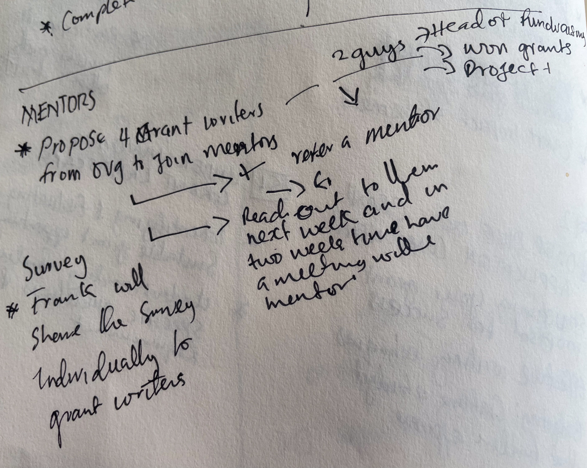
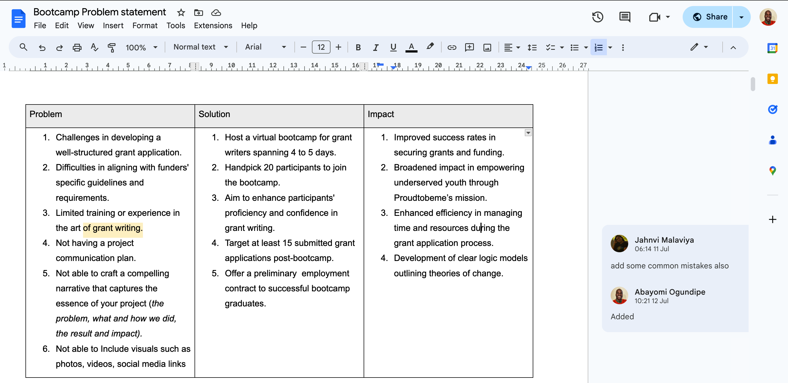

# The challenge

The grant writing bootcamp initiative underscored PTBM's commitment to not just empowering the youth they serve, but also investing in the continuous development of their own team. By enhancing their grant-writing capabilities, PTBM aims to significantly improve their success rates in obtaining grants, thereby securing the necessary funding to broaden the impact of their mission—empowering underserved youth and unlocking their potential.

### Understanding the problem

Before diving into planning, I wanted to gain understanding of the root cause behind the organization's decision to organize a grant writing bootcamp. To achieve this, I scheduled a briefing with the operations manager, who shared critical insights. I learned that despite the grant writing team submitting several grant applications, there had been a consistent lack of success in securing funding.

<figure><figcaption>
Noting actions to take for understanding and defining the problem after a brief call with operations manager of PTBM.
</figcaption></figure>

The operations manager highlighted that the primary problem stemmed from the team's low-level grant writing skills. Additionally, there was a significant gap in their knowledge about grant writing as a specialized skill, as well as a lack of awareness about the landscape of grant organizations and their specific requirements. These factors combined prompting the necessity for conducting a survey with PTBM grant team to understand their pain-points.

### Defining the problem statements

After identifying why PTBM isn't securing grants, I organized the issues in [Google Docs for clarity](https://docs.google.com/document/d/1WtIlBRjZYbt53-gz3LeQ2A0gPt1UuDMAdTNWkYtJR5s/edit). I created a table with three columns: problems, solutions (objectives), and impact, using the theory of change framework. I synthesized the problems to identify objectives and impacts. After drafting the solutions, I invited PTBM for another review.

<figure><figcaption>
Working document creating problem statement
</figcaption></figure>

Together with PTBM, we defined the bootcamp’s solutions by drafting specific objectives based on the synthesized problem statement. As a result, we crafted a clear and measurable solution statement (Outcome).
